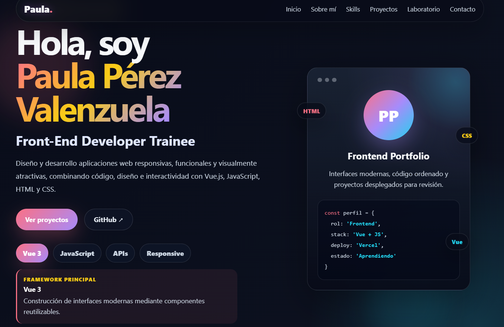
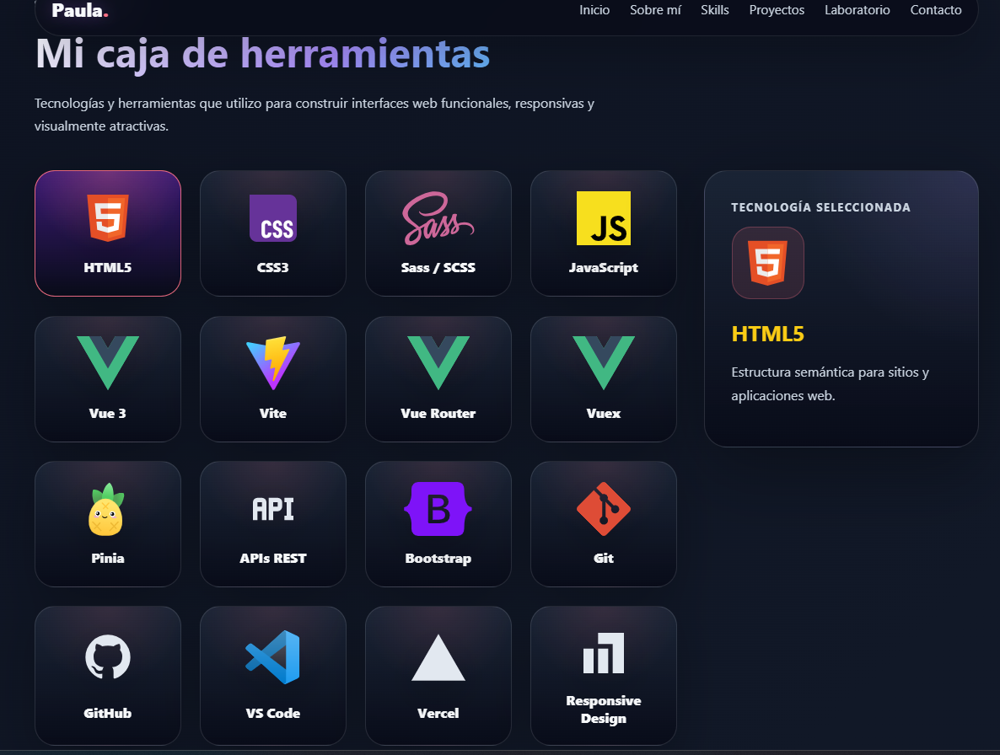
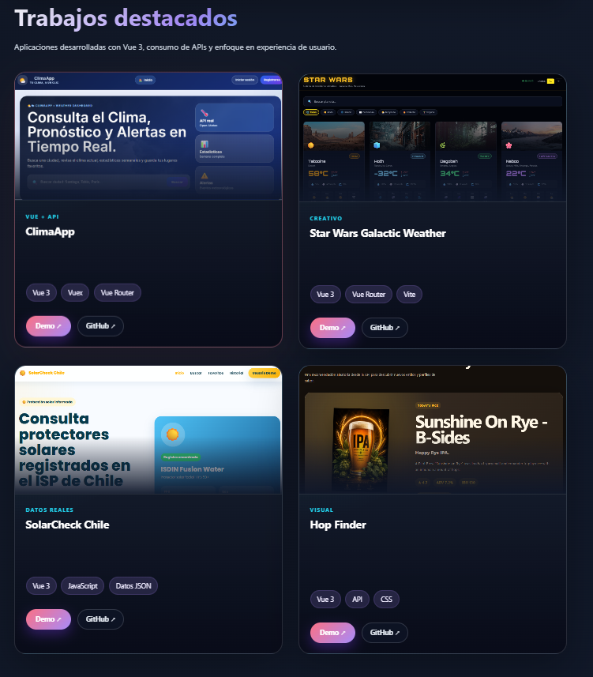
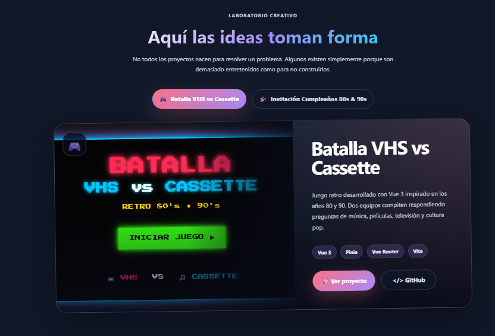
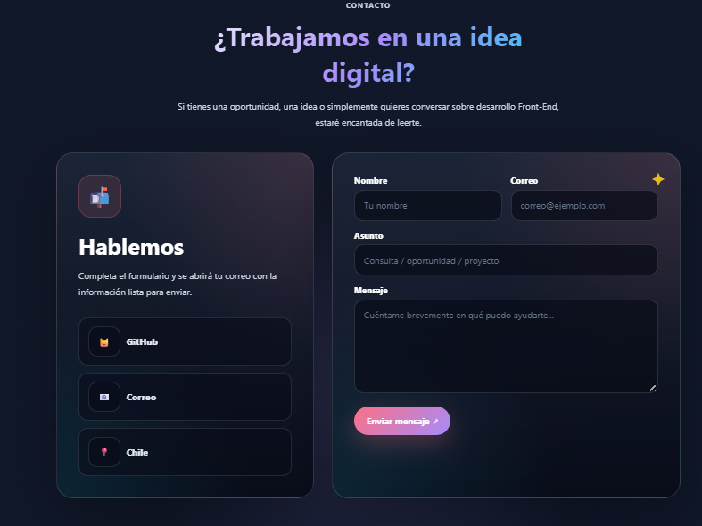

# ✨ Front-End Portfolio | Paula Pérez Valenzuela


---

# 🌟 Descripción

**Portafolio profesional desarrollado con Vue 3 donde presento los proyectos, aplicaciones y experimentos que han acompañado mi formación como Front-End Developer.**

Cada proyecto refleja mi evolución en desarrollo web, desde el consumo de APIs y la construcción de interfaces responsivas hasta la creación de experiencias interactivas, siempre con un enfoque en la organización del código, el diseño y la experiencia de usuario.

---

# 📑 Índice

- [🚀 Demo](#-demo)
- [📸 Capturas](#-capturas)
- [✨ Características](#-características)
- [🛠️ Tecnologías](#️-tecnologías)
- [📁 Estructura del Proyecto](#-estructura-del-proyecto)
- [💼 Proyectos Destacados](#-proyectos-destacados)
- [🧪 Laboratorio Creativo](#-laboratorio-creativo)
- [⚙️ Instalación](#️-instalación)
- [👩‍💻 Autora](#-autora)
- [📄 Licencia](#-licencia)

---

# 🚀 Demo

**🌐 Sitio Web**

https://portafolio-paula-one.vercel.app/

**💻 Repositorio**

https://github.com/Paula-front/portafolio-paula

---

# 📸 Capturas

## 🏠 Inicio



---

## 🛠️ Tecnologías



---

## 💼 Proyectos



---

## 🧪 Laboratorio Creativo



---

## 📬 Contacto



---

# ✨ Características

- 🎨 Diseño moderno con identidad visual propia.
- 📱 Diseño completamente responsive.
- ⚡ Desarrollado con Vue 3 y Vite.
- 💻 Componentes reutilizables.
- 🎯 Navegación de una sola página (SPA).
- 📂 Proyectos destacados con enlaces a GitHub y Vercel.
- 🧪 Sección Laboratorio para proyectos personales.
- 🎨 Animaciones e interacciones suaves.
- 📬 Formulario de contacto.
- 🚀 Despliegue automático mediante Vercel.

---

# 🛠️ Tecnologías

- Vue 3
- Vite
- JavaScript (ES6+)
- HTML5
- CSS3
- Iconify
- Git
- GitHub
- Vercel

---

# 📁 Estructura del Proyecto

```text
portafolio-paula
│
├── public
│   └── captura
│       ├── hero.png
│       ├── skills.png
│       ├── proyectos.png
│       ├── laboratorio.png
│       └── contacto.png
│
├── src
│   ├── assets
│   │   └── images
│   │       └── projects
│   │
│   ├── components
│   │   ├── layout
│   │   ├── sections
│   │   └── ui
│   │
│   ├── data
│   │   ├── laboratory.js
│   │   ├── projects.js
│   │   └── skills.js
│   │
│   ├── App.vue
│   ├── main.js
│   └── style.css
│
├── index.html
├── package.json
├── vite.config.js
└── README.md
```
```

---

# 💼 Proyectos Destacados

El portafolio reúne una selección de proyectos desarrollados durante mi formación Front-End, incluyendo aplicaciones con consumo de APIs, interfaces responsivas, componentes reutilizables y despliegues en producción.

Entre ellos se encuentran:

- 🌤️ ClimaApp
- 🌞 SolarCheck Chile
- 🌌 Star Wars Galactic Weather
- 🍺 Hop Finder

Cada proyecto incluye acceso directo a su repositorio en GitHub y a su versión desplegada.

---

# 🧪 Laboratorio Creativo

Además de los proyectos principales, el portafolio incorpora un espacio llamado **Laboratorio**, dedicado a iniciativas personales y experimentos creativos.

Actualmente incluye:

- 🎮 **Batalla VHS vs Cassette**
  Juego interactivo desarrollado para una celebración temática de los años 80 y 90.

- 🎉 **Invitación Interactiva de Cumpleaños**
  Landing Page desarrollada para una invitación digital con temática retro.

Esta sección continuará creciendo con nuevos proyectos y experimentos personales.

---

# ⚙️ Instalación

Clonar el repositorio

```bash
git clone https://github.com/Paula-front/portafolio-paula.git
```

Ingresar al proyecto

```bash
cd portafolio-paula
```

Instalar dependencias

```bash
npm install
```

Ejecutar servidor de desarrollo

```bash
npm run dev
```

Generar versión de producción

```bash
npm run build
```

---

# 👩‍💻 Autora

**Paula Pérez Valenzuela**

Front-End Developer Trainee

GitHub:

https://github.com/Paula-front

---

# 📄 Licencia

Este proyecto fue desarrollado con fines educativos y forma parte de mi portafolio profesional como Front-End Developer.